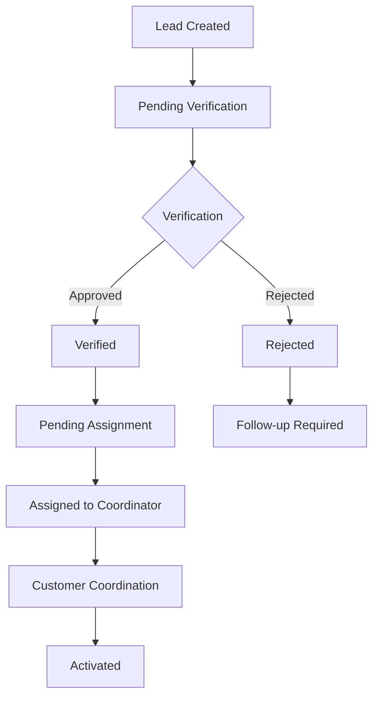
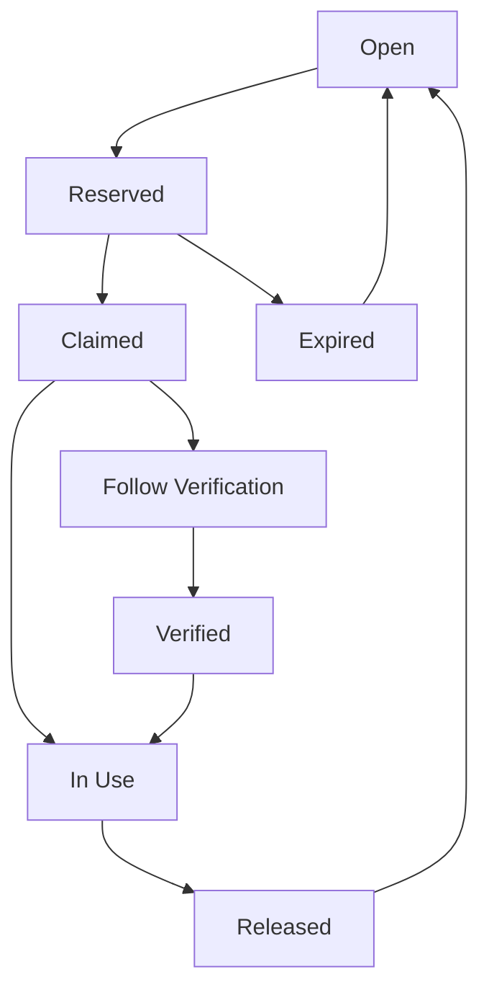
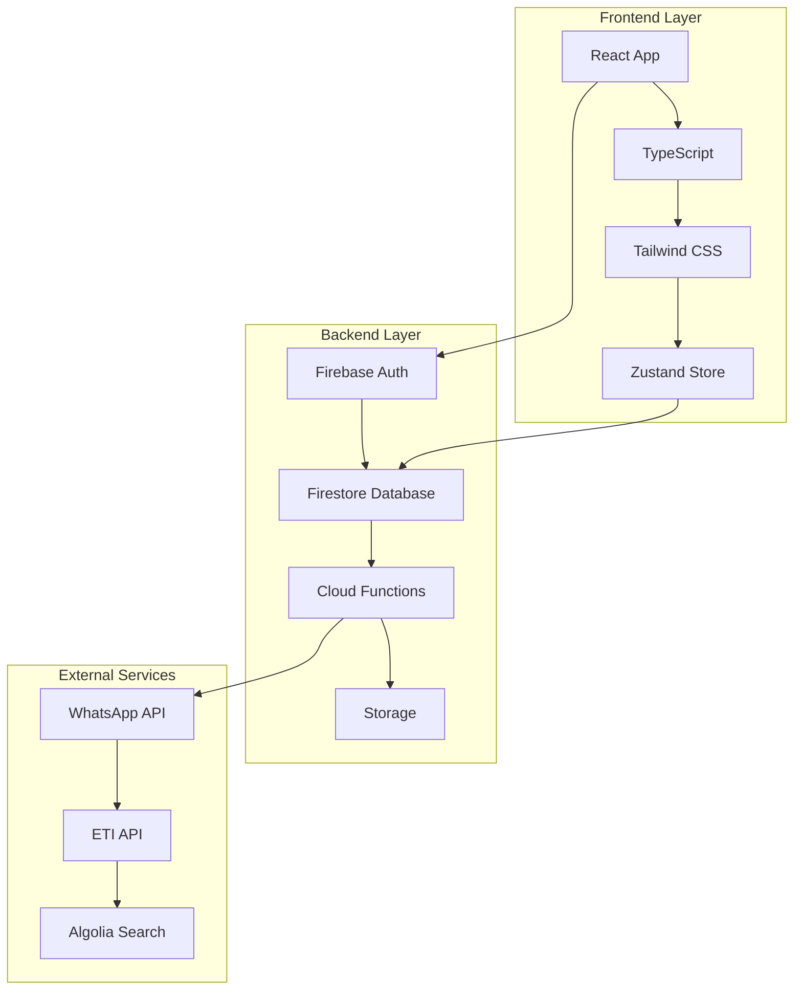
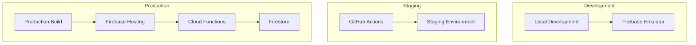

# 📋 CRM Lead Management System - Complete Documentation


## 📖 Table of Contents

1. [🏢 System Overview](#-system-overview)
2. [👥 User Roles & Permissions](#-user-roles--permissions)
3. [🎯 Lead Management System](#-lead-management-system)
4. [📞 Number Pool Management](#-number-pool-management)
5. [💰 Payroll & Attendance](#-payroll--attendance)
6. [📊 Dashboard Features](#-dashboard-features)
7. [🏗️ Technical Architecture](#️-technical-architecture)
8. [🔧 API & Cloud Functions](#-api--cloud-functions)
9. [🚀 Deployment & Configuration](#-deployment--configuration)
10. [❓ Troubleshooting & FAQ](#-troubleshooting--faq)

---

## 🏢 System Overview

### What is this CRM System?

The **CRM Lead Management System** is a comprehensive business management platform designed specifically for lead generation, customer relationship management, and team coordination. Built with modern web technologies, it provides real-time collaboration, advanced analytics, and streamlined workflows for sales teams.

### 🌟 Key Features

- **🎯 Lead Management**: Complete lead lifecycle from creation to activation
- **📞 Number Pool Management**: Smart phone number allocation and tracking
- **👥 Role-Based Access**: Granular permissions for different user types
- **💰 Payroll System**: Integrated salary and commission management
- **📊 Real-Time Analytics**: Live dashboards with performance metrics
- **📱 Progressive Web App**: Mobile-optimized with offline capabilities
- **🔐 Advanced Security**: Firebase authentication with device management
- **💬 WhatsApp Integration**: Automated customer communication
- **📈 Performance Tracking**: MAR (Minimum Achievement Required) monitoring

### 🏗️ Technology Stack

| Component | Technology | Version |
|-----------|------------|---------|
| **Frontend** | React + TypeScript | 18.3.1 |
| **Styling** | Tailwind CSS | 3.4.1 |
| **Backend** | Firebase Firestore | 10.8.0 |
| **Authentication** | Firebase Auth | 10.8.0 |
| **Functions** | Firebase Functions | 4.5.0 |
| **Build Tool** | Vite | 5.4.2 |
| **State Management** | Zustand | 4.5.2 |
| **UI Components** | Headless UI + Lucide | Latest |
| **Charts** | Recharts + Chart.js | Latest |

---

## 👥 User Roles & Permissions

### Role Hierarchy

The system implements a sophisticated role-based access control system with the following hierarchy:

```
Admin (Highest Authority)
├── Manager
├── Coordinator
├── Verifier
├── Agent
└── Freelancer (Limited Access)
```

### 🔐 Role Definitions

#### 👑 Admin
**Highest level access with complete system control**

**Permissions:**
- ✅ Full system access and configuration
- ✅ User management (create, edit, delete users)
- ✅ Team management and assignment
- ✅ Plan and commission configuration
- ✅ DNC list management
- ✅ Trusted device administration
- ✅ WhatsApp settings configuration
- ✅ System-wide analytics and reporting
- ✅ Number pool management (all groups)
- ✅ Lead management (all leads)

**Dashboard Features:**
- System overview metrics
- Team performance analytics
- User management interface
- Administrative tools panel
- Real-time monitoring

#### 👔 Manager
**Team oversight and management capabilities**

**Permissions:**
- ✅ Team member management
- ✅ Agent target setting and monitoring
- ✅ Commission configuration
- ✅ Payroll management
- ✅ Attendance tracking
- ✅ Lead oversight for team
- ✅ Performance analytics
- ✅ Leave application approval

**Dashboard Features:**
- Team performance metrics
- Agent target management
- Payroll and attendance tools
- Commission tracking
- Team analytics

#### 🎯 Coordinator
**Lead coordination and number pool management**

**Permissions:**
- ✅ Lead assignment and distribution
- ✅ Number pool coordination (group-specific)
- ✅ Customer coordination
- ✅ Lead status management
- ✅ Group-specific number access (G1, G2, G3, or all)
- ✅ Lead verification workflows

**Dashboard Features:**
- Lead coordination interface
- Number pool management
- Assignment workflows
- Performance tracking

#### ✅ Verifier
**Lead verification and quality assurance**

**Permissions:**
- ✅ Lead verification workflows
- ✅ Lead approval/rejection
- ✅ Media verification
- ✅ Group-specific lead access
- ✅ Verification reporting

**Dashboard Features:**
- Verification queue
- Lead review interface
- Quality metrics
- Verification history

#### 🎯 Agent
**Primary lead generation and customer interaction**

**Permissions:**
- ✅ Lead creation and management
- ✅ Number claiming (with strike limits)
- ✅ Customer communication
- ✅ Personal performance tracking
- ✅ Attendance logging
- ✅ Leave applications

**Dashboard Features:**
- Personal performance metrics
- Lead management tools
- Strike system tracking
- Quick access workflows

#### 💼 Freelancer
**Limited access for independent contractors**

**Permissions:**
- ✅ Basic lead creation
- ✅ Limited number pool access
- ✅ Personal performance view
- ❌ No team management
- ❌ No administrative functions

**Dashboard Features:**
- Simplified lead interface
- Basic performance metrics
- Limited number pool access

### 🔒 Permission Matrix

| Feature | Admin | Manager | Coordinator | Verifier | Agent | Freelancer |
|---------|-------|---------|-------------|----------|-------|------------|
| **User Management** | ✅ | ❌ | ❌ | ❌ | ❌ | ❌ |
| **Team Management** | ✅ | ✅ | ❌ | ❌ | ❌ | ❌ |
| **Lead Creation** | ✅ | ✅ | ✅ | ✅ | ✅ | ✅ |
| **Lead Verification** | ✅ | ✅ | ✅ | ✅ | ❌ | ❌ |
| **Number Pool Access** | All | Team | Group-based | Group-based | Limited | Limited |
| **Payroll Management** | ✅ | ✅ | ❌ | ❌ | ❌ | ❌ |
| **System Configuration** | ✅ | ❌ | ❌ | ❌ | ❌ | ❌ |
| **Analytics Access** | All | Team | Limited | Limited | Personal | Personal |

---

## 🎯 Lead Management System

### Lead Lifecycle Overview



### 📝 Lead Creation Process

#### 1. **Customer Information Collection**
- **Personal Details**: Name, phone number, email
- **Location Information**: Emirates, area, address
- **Demographics**: Age, gender, preferences
- **Contact Preferences**: Communication methods

#### 2. **Number Selection**
- **Number Pool Integration**: Real-time availability checking
- **Category Filtering**: Based on plan requirements
- **Group Assignment**: G1, G2, G3 coordination groups
- **Validation**: UAE phone number format validation (05XXXXXXXX)

#### 3. **Plan Configuration**
- **Plan Selection**: From configured plan categories
- **Benefits Display**: Dynamic benefits from Firebase
- **Pricing Information**: Real-time pricing updates
- **Terms and Conditions**: Legal compliance

#### 4. **WhatsApp Verification**
- **Automatic Messaging**: Configurable verification templates
- **Consent Management**: Customer consent tracking
- **Verification Status**: Real-time status updates

### 🔄 Lead Status Workflow

#### Status Definitions

| Status | Description | Next Actions |
|--------|-------------|--------------|
| **Pending Verification** | Newly created, awaiting review | Verifier review |
| **Verified** | Approved by verifier | Coordinator assignment |
| **Rejected** | Failed verification | Follow-up required |
| **Pending Assignment** | Ready for coordinator | Assignment to coordinator |
| **Assigned** | Assigned to coordinator | Customer coordination |
| **Activated** | Successfully activated | Complete |
| **Follow Verification** | Requires follow-up | Additional verification |

#### Verification Process

1. **Media Verification**
   - Document upload validation
   - Image quality assessment
   - Compliance checking

2. **Information Validation**
   - Customer data accuracy
   - Contact information verification
   - Plan eligibility confirmation


### 📊 Lead Management Features

#### Advanced Search & Filtering
- **Multi-field Search**: Name, number, plan, status
- **Date Range Filtering**: Creation date, verification date
- **Status-based Filtering**: Current workflow status
- **Role-based Filtering**: Access based on user permissions

#### Bulk Operations
- **Bulk Status Updates**: Multiple lead status changes
- **Bulk Assignment**: Mass coordinator assignments
- **Export Capabilities**: CSV, Excel export options
- **Batch Processing**: Efficient bulk operations

#### Real-time Updates
- **Live Status Updates**: Real-time workflow progress
- **Notification System**: Instant alerts for status changes
- **Collaboration Tools**: Team communication integration
- **Audit Trail**: Complete change history tracking

### 🎯 Lead Analytics

#### Performance Metrics
- **Conversion Rates**: Lead to activation ratios
- **Processing Times**: Average verification time
- **Team Performance**: Agent and coordinator metrics
- **Quality Metrics**: Verification accuracy rates

#### Reporting Features
- **Daily Reports**: Daily lead statistics
- **Weekly Summaries**: Weekly performance overview
- **Monthly Analytics**: Monthly trend analysis
- **Custom Reports**: Configurable report generation

---

## 📞 Number Pool Management

### Number Pool Architecture

The Number Pool system is the backbone of the CRM, managing phone number allocation, tracking, and coordination across different teams and groups.

### 🏗️ Number Pool Structure


#### Number Groups
- **G1 Group**: Primary coordination group
- **G2 Group**: Secondary coordination group  
- **G3 Group**: Tertiary coordination group
- **All Groups**: Cross-group access for coordinators

#### Number Status Lifecycle



### 📋 Number Pool Features

#### 1. **Smart Number Allocation**
- **Automatic Assignment**: AI-driven number selection
- **Preference Matching**: Customer preference consideration
- **Availability Checking**: Real-time availability status
- **Conflict Resolution**: Duplicate prevention

#### 2. **Reservation System**
- **Time-based Reservations**: Configurable reservation periods
- **Strike System**: Fair distribution with strike limits
- **Priority Queuing**: VIP customer prioritization
- **Auto-expiration**: Automatic reservation cleanup

#### 3. **Status Management**
- **Real-time Updates**: Live status synchronization
- **Status Tracking**: Complete number lifecycle tracking
- **Audit Trail**: Comprehensive change history
- **Bulk Operations**: Mass status updates

#### 4. **Search & Discovery**
- **Advanced Search**: Multi-criteria search functionality
- **Filtering Options**: Category, status, group filtering
- **Pagination**: Efficient large dataset handling
- **Caching**: Optimized performance with IndexedDB

### 🔧 Number Pool Operations

#### Number Creation
```typescript
interface NumberPool {
  id: string;
  number: string;
  category: string;
  code: string;
  group: string;
  status: NumberStatus;
  passcode?: string;
  teamVisibility?: string;
  visibleToFreelancers: boolean;
  lastStatusChange: Date;
  reservationCount: number;
  claimCount: number;
}
```

#### Reservation Process
1. **Availability Check**: Verify number availability
2. **Reservation Creation**: Create time-based reservation
3. **Status Update**: Update number status to 'reserved'
4. **Timer Setup**: Configure expiration timer
5. **Notification**: Alert relevant stakeholders

#### Claiming Process
1. **Reservation Validation**: Verify valid reservation
2. **Strike Check**: Validate user strike limits
3. **Status Update**: Change status to 'claimed'
4. **Audit Log**: Record claim action
5. **Integration**: Connect with lead management

### 📊 Number Pool Analytics

#### Performance Metrics
- **Utilization Rates**: Number usage statistics
- **Reservation Efficiency**: Reservation success rates
- **Processing Times**: Average claim processing time
- **Team Performance**: Group-specific metrics

#### Monitoring Features
- **Real-time Dashboard**: Live number pool status
- **Alert System**: Automated notifications for issues
- **Trend Analysis**: Historical usage patterns
- **Capacity Planning**: Resource allocation insights

---

## 💰 Payroll & Attendance

### Payroll System Overview

The integrated payroll system provides comprehensive salary management, commission tracking, and expense management for all team members.

### 💼 Payroll Features

#### 1. **Salary Management**
- **Base Salary Configuration**: Individual salary settings
- **Salary History**: Complete salary change tracking
- **Automated Calculations**: Real-time salary computations
- **Tax Management**: Integrated tax calculations

#### 2. **Commission System**
- **Performance-based Commissions**: Achievement-based rewards
- **Tier-based Structure**: Multiple commission tiers
- **Real-time Tracking**: Live commission calculations
- **Bonus System**: Achievement bonuses and rewards

#### 3. **Expense Management**
- **Office Expenses**: Team expense tracking
- **Personal Expenses**: Individual expense management
- **Approval Workflows**: Manager approval processes
- **Receipt Management**: Digital receipt storage

#### 4. **Invoice Generation**
- **Automated PDF Generation**: Professional invoice creation
- **Custom Templates**: Branded invoice templates
- **Integration**: Payroll data integration
- **Export Options**: Multiple export formats

### 📊 Commission Structure

#### Achievement Tiers
- **Target Achievement**: 100% target completion
- **Rising Star**: 110% target achievement
- **Super Achiever**: 125% target achievement
- **Elite Performer**: 150% target achievement
- **Master Achiever**: 175% target achievement
- **Legendary Status**: 200%+ target achievement

#### MAR (Minimum Achievement Required)
- **Individual MAR**: Personal minimum requirements
- **Team MAR**: Team-based minimum standards
- **Monthly Tracking**: Monthly MAR monitoring
- **Performance Alerts**: MAR breach notifications

### 🕐 Attendance System

#### Attendance Features
- **Clock In/Out**: Digital time tracking
- **Location Tracking**: GPS-based attendance
- **Break Management**: Break time tracking
- **Overtime Calculation**: Automatic overtime computation

#### Leave Management
- **Leave Applications**: Digital leave requests
- **Approval Workflows**: Manager approval system
- **Leave Types**: Sick, vacation, personal leave
- **Balance Tracking**: Leave balance management

#### Reporting
- **Daily Reports**: Daily attendance summaries
- **Weekly Reports**: Weekly attendance analysis
- **Monthly Reports**: Monthly attendance trends
- **Custom Reports**: Configurable report generation

---

## 📊 Dashboard Features

### Role-Specific Dashboards

Each user role has a customized dashboard optimized for their specific responsibilities and workflows.

### 👑 Admin Dashboard

#### System Overview
- **Total Users**: Complete user count across all roles
- **Active Teams**: Number of active teams
- **System-wide Leads**: Total leads across all teams
- **Performance Metrics**: System-wide performance indicators

#### Team Performance Analytics
- **Team Comparison**: Side-by-side team performance
- **Agent Rankings**: Individual agent performance rankings
- **Target Achievement**: Team target completion rates
- **Commission Tracking**: Team commission distribution

#### Administrative Tools
- **User Management**: Complete user administration
- **Plan Configuration**: Service plan management
- **DNC Management**: Do Not Call list administration
- **System Settings**: Global system configuration

### 👔 Manager Dashboard

#### Team Management
- **Team Overview**: Complete team performance summary
- **Agent Performance**: Individual agent metrics
- **Target Management**: Agent target setting and tracking
- **Commission Configuration**: Team commission settings

#### HR Management
- **Payroll Access**: Team payroll management
- **Attendance Tracking**: Team attendance monitoring
- **Leave Approvals**: Leave application processing
- **Performance Reviews**: Agent performance evaluation

### 🎯 Coordinator Dashboard

#### Lead Coordination
- **Assignment Queue**: Pending lead assignments
- **Lead Distribution**: Lead allocation management
- **Status Tracking**: Real-time lead status updates
- **Customer Coordination**: Customer communication tools

#### Number Pool Management
- **Group-specific Access**: G1, G2, G3 number pools
- **Number Assignment**: Number allocation to leads
- **Status Monitoring**: Number pool status tracking
- **Reservation Management**: Number reservation oversight

### ✅ Verifier Dashboard

#### Verification Queue
- **Pending Verifications**: Leads awaiting verification
- **Verification History**: Completed verification records
- **Quality Metrics**: Verification accuracy tracking
- **Performance Analytics**: Personal verification metrics

#### Verification Tools
- **Media Review**: Document and image verification
- **Information Validation**: Customer data verification
- **Approval Workflows**: Lead approval/rejection process
- **Follow-up Management**: Follow-up verification tracking

### 🎯 Agent Dashboard

#### Personal Performance
- **Lead Statistics**: Personal lead creation metrics
- **Target Progress**: MAR achievement tracking
- **Commission Tracking**: Personal commission calculations
- **Performance Charts**: Visual performance indicators

#### Workflow Tools
- **Lead Creation**: Quick lead creation interface
- **Number Pool Access**: Limited number pool access
- **Strike Tracking**: Personal strike system monitoring
- **Quick Actions**: Fast access to common tasks

### 📱 Mobile Optimization

#### Responsive Design
- **Mobile-first Approach**: Optimized for mobile devices
- **Touch-friendly Interface**: Mobile gesture support
- **Offline Capabilities**: PWA offline functionality
- **Push Notifications**: Real-time mobile notifications

#### Performance Optimization
- **Fast Loading**: Optimized loading times
- **Efficient Caching**: Smart data caching
- **Reduced Data Usage**: Minimal data consumption
- **Battery Optimization**: Power-efficient operation

---

## 🏗️ Technical Architecture

### System Architecture Overview



### 🏛️ Frontend Architecture

#### Component Structure
```
src/
├── components/
│   ├── auth/           # Authentication components
│   ├── dashboards/     # Role-specific dashboards
│   ├── Leads/          # Lead management components
│   ├── layout/         # Layout components
│   └── modals/         # Modal components
├── pages/              # Page components
├── hooks/              # Custom React hooks
├── services/           # Business logic services
├── store/              # State management
├── types/              # TypeScript definitions
└── utils/              # Utility functions
```

#### State Management
- **Zustand Store**: Lightweight state management
- **Firebase Integration**: Real-time data synchronization
- **Local Storage**: Persistent data caching
- **IndexedDB**: Advanced client-side storage

### 🔥 Backend Architecture

#### Firebase Services
- **Firestore**: NoSQL document database
- **Authentication**: User authentication and authorization
- **Cloud Functions**: Serverless backend logic
- **Storage**: File and media storage
- **Hosting**: Static site hosting

#### Database Design
```typescript
// Collections Structure
users/           # User accounts and profiles
teams/           # Team information and hierarchy
leads/           # Lead data and workflow
numberPool/      # Phone number management
chats/           # Real-time messaging
notifications/   # System notifications
plans/           # Service plan configurations
payroll/         # Payroll and attendance data
```

### 🔧 Integration Architecture

#### WhatsApp Integration
- **Webhook Handlers**: Inbound message processing
- **Message Routing**: Lead resolution and routing
- **Consent Management**: Customer consent tracking
- **Template Management**: Message template configuration

#### External API Integration
- **ETI API Proxy**: Number status checking
- **CORS Handling**: Cross-origin request management
- **Rate Limiting**: API call optimization
- **Error Handling**: Robust error management

### 🚀 Performance Optimization

#### Frontend Optimization
- **Code Splitting**: Lazy loading of components
- **Bundle Optimization**: Minimized bundle sizes
- **Caching Strategies**: Intelligent data caching
- **Image Optimization**: Optimized media handling

#### Backend Optimization
- **Query Optimization**: Efficient Firestore queries
- **Indexing Strategy**: Optimized database indexes
- **Caching Layers**: Multi-level caching
- **Function Optimization**: Efficient cloud functions

---

## 🔧 API & Cloud Functions

### Cloud Functions Overview

The system uses Firebase Cloud Functions to handle server-side logic, external API integrations, and automated workflows.

### 📡 Core Functions

#### 1. **Number Management Functions**

##### `claimNumber`
**Purpose**: Handles number claiming with strike system validation
```typescript
// Function signature
export const claimNumber = functions.https.onCall(async (data, context) => {
  // Validate authentication
  // Check strike limits
  // Update number status
  // Log claim action
});
```

**Features:**
- Strike limit validation
- Atomic number claiming
- Audit trail logging
- Real-time status updates

##### `checkNumberAvailability`
**Purpose**: Real-time number availability checking
```typescript
export const checkNumberAvailability = functions.https.onCall(async (data, context) => {
  // Check number status
  // Validate permissions
  // Return availability status
});
```

#### 2. **Lead Management Functions**

##### `processLeadRejection`
**Purpose**: Handles lead rejection workflow
```typescript
export const processLeadRejection = functions.https.onCall(async (data, context) => {
  // Validate rejection reason
  // Update lead status
  // Trigger follow-up workflow
  // Send notifications
});
```

#### 3. **WhatsApp Integration Functions**

##### `whatsappWebhook`
**Purpose**: Handles inbound WhatsApp messages
```typescript
export const whatsappWebhook = functions.https.onRequest(async (req, res) => {
  // Parse incoming message
  // Route to appropriate handler
  // Update lead status
  // Send response
});
```

**Features:**
- Message parsing and validation
- Lead resolution and routing
- Consent extraction
- Automated responses

#### 4. **Admin Functions**

##### `resetUserPassword`
**Purpose**: Admin password reset functionality
```typescript
export const resetUserPassword = functions.https.onCall(async (data, context) => {
  // Validate admin permissions
  // Reset user password
  // Send reset email
  // Log admin action
});
```

### 🔄 Automated Functions

#### 1. **Expiry Management**

##### `handleClaimExpiry`
**Purpose**: Automatic claim expiry handling
```typescript
export const handleClaimExpiry = functions.pubsub.schedule('every 1 hours').onRun(async (context) => {
  // Find expired claims
  // Release numbers back to pool
  // Update status
  // Send notifications
});
```

##### `simpleReservationExpiry`
**Purpose**: Reservation expiry management
```typescript
export const simpleReservationExpiry = functions.pubsub.schedule('every 30 minutes').onRun(async (context) => {
  // Check reservation expiry
  // Release expired reservations
  // Update number status
  // Clean up expired data
});
```

#### 2. **Statistics Management**

##### `updateNumberPoolStats`
**Purpose**: Real-time statistics updates
```typescript
export const updateNumberPoolStatsOnCreate = functions.firestore
  .document('numberPool/{numberId}')
  .onCreate(async (snap, context) => {
    // Update pool statistics
    // Recalculate metrics
    // Update dashboard data
  });
```

### 🌐 External API Integration

#### ETI API Integration
```typescript
// Number status checking
export const checkNumberStatus = functions.https.onCall(async (data, context) => {
  // Call ETI API
  // Validate response
  // Update number status
  // Handle errors
});
```

#### CORS Configuration
```typescript
// CORS handling for client-side calls
export const checkNumberStatusHTTP = functions.https.onRequest(async (req, res) => {
  // Set CORS headers
  // Validate request
  // Process API call
  // Return response
});
```

### 📊 Function Monitoring

#### Performance Monitoring
- **Execution Time Tracking**: Function performance monitoring
- **Error Rate Monitoring**: Function error tracking
- **Usage Analytics**: Function usage statistics
- **Cost Optimization**: Function cost monitoring

#### Logging and Debugging
- **Structured Logging**: Comprehensive function logging
- **Error Tracking**: Detailed error reporting
- **Performance Metrics**: Function performance data
- **Debug Information**: Development debugging support

---

## 🚀 Deployment & Configuration

### Deployment Architecture



### 🔧 Environment Setup

#### Prerequisites
- **Node.js**: Version 18.x or higher
- **npm/yarn**: Package manager
- **Firebase CLI**: Firebase command line tools
- **Git**: Version control system

#### Installation Steps

1. **Clone Repository**
```bash
git clone https://github.com/tayasarbhat/crm-system.git
cd crm-system
```

2. **Install Dependencies**
```bash
npm install
# or
yarn install
```

3. **Firebase Setup**
```bash
npm install -g firebase-tools
firebase login
firebase init
```

4. **Environment Configuration**
```bash
# Create environment files
cp .env.example .env.local
# Configure Firebase project settings
```

### 🏗️ Build Configuration

#### Vite Configuration
```typescript
// vite.config.ts
export default defineConfig({
  plugins: [
    react(),
    VitePWA({
      registerType: 'autoUpdate',
      workbox: {
        globPatterns: ['**/*.{js,css,html,ico,png,svg}']
      }
    })
  ],
  build: {
    outDir: 'dist',
    sourcemap: true
  }
});
```

#### TypeScript Configuration
```json
{
  "compilerOptions": {
    "target": "ES2020",
    "lib": ["ES2020", "DOM", "DOM.Iterable"],
    "module": "ESNext",
    "skipLibCheck": true,
    "moduleResolution": "bundler",
    "allowImportingTsExtensions": true,
    "resolveJsonModule": true,
    "isolatedModules": true,
    "noEmit": true,
    "jsx": "react-jsx",
    "strict": true,
    "noUnusedLocals": true,
    "noUnusedParameters": true,
    "noFallthroughCasesInSwitch": true
  }
}
```

### 🔥 Firebase Configuration

#### Firestore Rules
```javascript
// firestore.rules
rules_version = '2';
service cloud.firestore {
  match /databases/{database}/documents {
    // User access rules
    match /users/{userId} {
      allow read, write: if request.auth != null && request.auth.uid == userId;
    }
    
    // Team access rules
    match /teams/{teamId} {
      allow read: if isSignedIn() && isTeamMember(teamId);
      allow write: if hasRole('admin') || isTeamManager(teamId);
    }
    
    // Lead access rules
    match /leads/{leadId} {
      allow read: if isSignedIn() && hasLeadAccess();
      allow write: if isSignedIn() && hasLeadWriteAccess();
    }
  }
}
```

#### Cloud Functions Configuration
```typescript
// functions/src/index.ts
import * as functions from 'firebase-functions';

// Configure function region and timeout
export const claimNumber = functions
  .region('us-central1')
  .runWith({
    timeoutSeconds: 300,
    memory: '512MB'
  })
  .https.onCall(async (data, context) => {
    // Function implementation
  });
```

### 🚀 Deployment Process

#### Development Deployment
```bash
# Start development server
npm run dev

# Start Firebase emulators
firebase emulators:start
```

#### Production Deployment
```bash
# Build application
npm run build

# Deploy to Firebase
firebase deploy

# Deploy only functions
firebase deploy --only functions

# Deploy only hosting
firebase deploy --only hosting
```

### 🔐 Security Configuration

#### Authentication Setup
```typescript
// Firebase Auth configuration
import { initializeApp } from 'firebase/app';
import { getAuth } from 'firebase/auth';

const firebaseConfig = {
  apiKey: process.env.VITE_FIREBASE_API_KEY,
  authDomain: process.env.VITE_FIREBASE_AUTH_DOMAIN,
  projectId: process.env.VITE_FIREBASE_PROJECT_ID,
  storageBucket: process.env.VITE_FIREBASE_STORAGE_BUCKET,
  messagingSenderId: process.env.VITE_FIREBASE_MESSAGING_SENDER_ID,
  appId: process.env.VITE_FIREBASE_APP_ID
};

const app = initializeApp(firebaseConfig);
export const auth = getAuth(app);
```

#### Environment Variables
```bash
# .env.local
VITE_FIREBASE_API_KEY=your_api_key
VITE_FIREBASE_AUTH_DOMAIN=your_project.firebaseapp.com
VITE_FIREBASE_PROJECT_ID=your_project_id
VITE_FIREBASE_STORAGE_BUCKET=your_project.appspot.com
VITE_FIREBASE_MESSAGING_SENDER_ID=your_sender_id
VITE_FIREBASE_APP_ID=your_app_id
```

### 📊 Monitoring & Analytics

#### Performance Monitoring
- **Firebase Performance**: Application performance tracking
- **Error Monitoring**: Crash reporting and error tracking
- **Analytics**: User behavior and usage analytics
- **Custom Metrics**: Business-specific metrics tracking

#### Logging Configuration
```typescript
// Cloud Functions logging
import * as functions from 'firebase-functions';

export const myFunction = functions.https.onCall(async (data, context) => {
  functions.logger.info('Function called', { data, userId: context.auth?.uid });
  
  try {
    // Function logic
    functions.logger.info('Function completed successfully');
  } catch (error) {
    functions.logger.error('Function failed', error);
    throw error;
  }
});
```

---

## ❓ Troubleshooting & FAQ

### 🔧 Common Issues

#### Authentication Issues

**Problem**: Users cannot log in
**Solutions**:
1. Check Firebase Auth configuration
2. Verify user exists in Firestore users collection
3. Check browser console for errors
4. Validate Firebase project settings

**Problem**: Role-based access not working
**Solutions**:
1. Verify user role in Firestore
2. Check Firestore security rules
3. Validate role assignment logic
4. Review authentication state

#### Performance Issues

**Problem**: Slow loading times
**Solutions**:
1. Enable Firebase caching
2. Optimize Firestore queries
3. Implement pagination
4. Use IndexedDB for local caching

**Problem**: High Firebase costs
**Solutions**:
1. Optimize query patterns
2. Implement efficient pagination
3. Use composite indexes
4. Monitor function execution time

#### Number Pool Issues

**Problem**: Numbers not showing as available
**Solutions**:
1. Check number status in Firestore
2. Verify reservation expiry
3. Run cleanup functions
4. Check strike system limits

**Problem**: Reservation conflicts
**Solutions**:
1. Implement atomic transactions
2. Add conflict resolution logic
3. Monitor reservation timers
4. Clear expired reservations

### 📋 FAQ

#### General Questions

**Q: How do I add a new user to the system?**
A: Administrators can add users through the User Management page. Navigate to Admin → User Management → Add User.

**Q: How does the strike system work?**
A: The strike system prevents users from claiming too many numbers. Each user has a strike limit, and strikes are deducted when claiming numbers.

**Q: Can I customize the commission structure?**
A: Yes, managers and admins can configure commission rates and bonus structures through the payroll system.

**Q: How do I backup the system data?**
A: Firebase provides automatic backups. You can also export data through the admin dashboard or use Firebase CLI tools.

#### Technical Questions

**Q: How do I update the system?**
A: Use `git pull` to get latest changes, then `npm run build` and `firebase deploy` to deploy updates.

**Q: How do I monitor system performance?**
A: Use Firebase Console for real-time monitoring, or check the built-in analytics dashboards.

**Q: Can I integrate with other systems?**
A: Yes, the system provides APIs and webhooks for integration with external systems.

**Q: How do I handle data migration?**
A: Use Firebase CLI tools or custom migration scripts to move data between environments.


**Last Updated**: 20 Oct 2025
**Documentation Version**: 1.0.0
